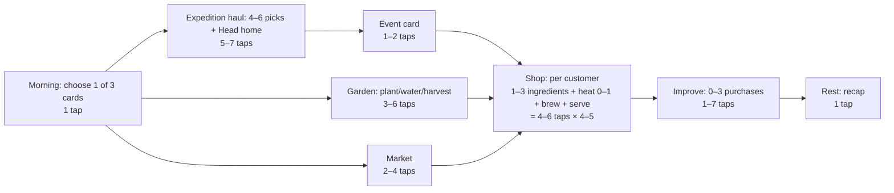

# Design Quality Review: M0c, session 4 (2026-10-07)

**Evidence sources:**
- `validation.md` (prototypes A, B, C/C2/C3; checks 4 and 6)
- `tools/*.py` (request space, economy, haul)
- The design docs: GDD, brew-math, content-bible, expedition, economy, art-direction

---

## Check 5: decision audit (each phase)
| Phase | Decisions | Trade-off | Is one option always best? |
|---|---|---|---|
| **Morning** | Choose 1 of 3 random cards (expedition, garden, market, errand, study) | Expedition: weather-driven finds and rares, but plants pause. Garden: steady chosen herbs, no rares. Market/errand/study: coins, relationships or knowledge, but no gathering | **No.** The value of each card depends on the day's draw, the weather, your shelf and tomorrow's clue *(revised 2026-10-08 after the editor found the 3-AP model had a dead third point)* |
| ↳ Haul | 5 slots out of 8–10 finds | Tomorrow's need vs wilting stock vs value vs rarity vs heavy finds, all shifted by the weather | **No** (`haul_sim`: the planner beats every one-factor strategy by 10–20%; each strategy wins some runs; the weather changes the best haul on 53% of days) |
| ↳ Event card | Spot the herb, an encounter choice | Small and flavourful, never punishing | Low stakes by design |
| **Prepare & Sell** | Which ingredients, Simmer or Boil, which customer gets which bottle (batches of 2–3), spend rares now or keep them for Midsummer | Precision vs serving two customers from one batch; rares now vs festival | **No** (check 4: 2–6 three-star answers per tier-1 request; tier 2/3 constrained by the basket) |
| **Improve** | Order of purchases, donations vs upgrades vs decor | Day 5: kettle (more sales) vs drying rack + compost (less waste); saving for the 5th slot | **No** (check 6: weak, average and strong bots all reach the finale by different routes) |
| **Rest** | None, by design (about 10 s) | — | — (gameplay is planned here in v2, with the moon altar) |

**Verdict: ✅ PASS.** Every active phase has at least one real trade-off, backed by simulation.

## Check 7: time budget (one day)
| Phase | Day 1 (scripted) | Mid game (days 7–12) | Late game (days 15–20) | Source |
|---|---|---|---|---|
| Morning | — (skipped day 1) | Card choice 5 s + (haul ~30 s + event ~10 s) or garden ~15 s ≈ **20–45 s** | ≈ 20–45 s | C3: haul 204 → 10 s, median 40 s, settling under 30 s |
| Prepare & Sell | 3 customers × ~60 s ≈ **3 min** | 4–5 customers × ~60 s, batches save time ≈ **4–5 min** | 6 customers ≈ **5–6 min** | **Estimate, not measured:** your B timing is pending |
| Improve | 30 s | 60 s | 60–90 s | estimate |
| Rest | 10 s | 10 s | 10 s | by design |
| **Total** | **≈ 4 min** | **≈ 6–7 min** | **≈ 8–9 min** | target 5–15 min |

**Verdict: ✅ PASS**, conditional on your B timing. Day 1 is a little under 5 minutes, which is fine for a scripted tutorial day.

## Check 8: tap-flow of one mid-game day

- **Total:** about **40–60 taps per day**, about 70% of them inside the brew loop.
- **No screen is more than 2 taps from the next phase.**
- **Wireframe:** the 360px brew screen exists (prototypes A and B); the haul screen exists (prototype C3).

**Verdict: ✅ PASS.**

---

## Novelty chart: days 1–20
Every day has at least one new thing (★ = a new system or area; ● = a story or content beat). **Daily variety in every day:** weather (5 kinds) and an event card.

| Day | New | | Day | New |
|---|---|---|---|---|
| 1 | ★ Brewing, serving (scripted) | | 11 | ● Glowcap night-bloom |
| 2 | ★ Garden | | 12 | ● Sunwort seed, ★ lantern |
| 3 | ★ Meadow expedition, the haul | | 13 | ★ Under the Hill (cave) |
| 4 | ★ Kettle, teas | | 14 | ● Festival announced, ★ donations |
| 5 | ★ Drying rack, freshness, tonic | | 15 | ● Festival prep, tier-3 riddles |
| 6 | ● Marla's first story beat, lavender seed | | 16 | ● Regular beats |
| 7 | ★ Whisperwood | | 17 | ● Regular beats |
| 8 | ● Bramble's rhyme requests, Wren's letter, ★ decor | | 18 | ● Regular beats |
| 9 | ★ Salve pot, salves | | 19 | ● Harvest the Sunwort |
| 10 | ★ 5th cauldron slot | | 20 | ★ Midsummer Draught, the finale |

**Verdict:** ✅ no dead days (also confirmed by check 6). ⚠️ Days 16–18 lean on story beats alone, so writing quality matters there.

## Storyboard: the first 10 minutes
| Time | Screen | Player does | Learns | Pillar |
|---|---|---|---|---|
| 0:00 | Wren's letter over the dark shop | Reads 3 lines and taps "Light the hearth" | Premise, 20 days, the festival | 3 |
| 0:30 | Bramble appears in the chimney (rhyme) | Taps through 2 lines | Bramble is the guide | — |
| 0:50 | **Marla:** "Up all week… I just need to sleep." | The Notebook pulses; opens it and reads "The four traits" + Wren's rules | Sleep → Calm; intensity words | 1, 2 |
| 1:20 | Brew screen (shelf pre-stocked) | Chamomile ×2, simmer, brew, serve (**first sale under 90 s**) | Honest meter, stars | 1 |
| 2:00 | Result: ★★★, "sleep" decoded | — | Decoded words get underlined | 2 |
| 2:30 | **Pell:** "A bit chilled…" | Tries fireroot on simmer; the meter shows the loss; Wren's note; switches to Boil | Roots want a boil (R2) | 2 |
| 4:00 | **Fennick:** "Head's in a fog" | Sage (± mint); a quick success | Confidence | 1 |
| 5:00 | Improve: coin count, the 4th slot shown locked | Taps Continue | Something to buy tomorrow | 3 |
| 5:30 | Rest: recap + teaser ("Tomorrow: Marla, *something to quiet the mind*. The garden is ready to clear.") | Taps Sleep | Tomorrow's clue → day 2 | 3 |
| 6:00 | Day 2 morning: garden | Clears a plot, plants chamomile | Growth over days | 3 |
| 7:00 | Day 2 shop: 3 customers, one with a 2-trait riddle | Brews from shelf stock | Combining traits | 1 |
| 10:00 | End of day 2 | — | The loop is clear | all |

**Verdict:** ⚠️ written but **not playtested**. The tutorial beats come from the B blind tests (opening the Notebook first was the fix that mattered).

## Pillar matrix
| Feature | 1 Read the customer | 2 Discovery | 3 One more day | 4 Cozy stakes |
|---|---|---|---|---|
| Riddle requests + keywords | ● | ● | | |
| Honest preview meter | ● | ● | | |
| Simmer/Boil + reaction rules | | ● | | |
| Wren's Notebook | ● | ● | | |
| Featured request teased the night before | ● | | ● | |
| Choose your haul | ● | | ● | ● |
| Weather (whole day) | | | ● | |
| Event cards (Spot the herb, …) | | ● | ● | ● |
| Garden, multi-day growth | | | ● | |
| Freshness + drying rack | | | ● | ● |
| Relationships (never decrease) | ● | | ● | ● |
| Economy / upgrades / decor | | | ● | |
| Festival + donations + finale | | | ● | ● |

No feature lacks a pillar. ✅ Earlier cuts: the mortar (merged into the salve pot), the grid and walk mini-games, "Nothing wasted", Linger.

---

## Design-quality checklist (1–5)
| # | Item | Score | Evidence |
|---|---|---|---|
| 1 | Legibility | 3 | The honest preview; blind test 5/5 tier 1 and 4/4 tier 2 after the trait guide. **Human B playtest pending.** |
| 2 | Meaningful choice | 4 | Check 5; haul_sim; the day-5 purchase dilemma |
| 3 | Depth/complexity ratio | 4 | 4 traits, 2 heats, 8 rules → 2–6 answers per request; depth grows through the basket and tier-2/3 ingredients |
| 4 | Feedback loops in check | 4 | economy_sim: no hoarding (average bot), decor and donations as sinks; the strong player keeps a surplus for endless mode |
| 5 | Novelty curve | 4 | The chart above; days 16–18 rely on writing |
| 6 | First-time player journey | 3 | Storyboard written, first sale under 90 s planned, **not yet playtested** |
| 7 | Pillar matrix | 5 | Every feature mapped; cuts made |
| 8 | Fiction ↔ mechanics | 5 | Real infusion/decoction, Midsummer folklore, Wren's Notebook as the spine, weather affecting herbs |
| 9 | Recovery | 4 | No fail state; missed opportunities only; the weak bot still finishes |
| 10 | Post-festival hook | 3 | Endless mode only sketched |
| | **Average** | **3.9** | Gate requires ≥ 4.0 → ⚠️ just under. Legibility lowered to 3 per the editor until a human plays B. |

**Weakest areas:** #6 (needs your B playtest, then the M1 slice) and #10 (endless mode needs a spec before M3).
